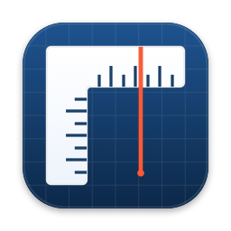

# Ruler

**[www.joelsanden.se/ruler](https://www.joelsanden.se/ruler/)**

A macOS screen ruler that floats above every other window. One horizontal ruler,
one vertical ruler, tick marks in pixels, a live red line on each ruler showing
exactly where the pointer is, full-screen crosshair marklines, draggable fixed
guides, and shift-drag measuring.

Runs as a menu-bar-only app (no Dock icon, no windows to manage). Universal
binary, macOS 13 or later. No accessibility or screen-recording permission
needed.

## Install

[**Download Ruler.dmg**](https://github.com/simpel/ruler/releases/latest/download/Ruler.dmg)
and drag Ruler into your Applications folder.

Or with Homebrew:

```bash
brew install --cask simpel/tap/ruler
```

Either way, Ruler is not signed with an Apple Developer ID, so macOS
quarantines it — Homebrew always applies the quarantine flag too. Clear it once
after installing:

```bash
xattr -dr com.apple.quarantine /Applications/Ruler.app
```

Or open the app once from **System Settings → Privacy & Security → Open
Anyway**.

Turn on **Launch at Login** in Ruler's menu if you want it to start with your
session.

## Build from source

Needs the Xcode Command Line Tools (`xcode-select --install`) — full Xcode is
not required.

```bash
./run.sh
```

That builds for your own architecture and launches the app; look for the ruler
icon in the menu bar.

| Script | What it does |
| --- | --- |
| `./run.sh` | Fast native build, then relaunch |
| `./build.sh` | Universal build (arm64 + x86_64) into `build/Ruler.app` |
| `./build.sh --fast` | Native architecture only |
| `./package.sh` | Universal build plus `build/dist/Ruler-<version>.{dmg,zip}` |

The icon is generated from `Tools/make-icon.swift` and cached as
`Resources/AppIcon.icns`; edit the script and rebuild to change it.

To produce a signed, notarizable build, set `CODESIGN_IDENTITY` to a
"Developer ID Application: …" identity before running `./build.sh`, then
notarize the DMG with `xcrun notarytool submit` and staple it.

Pushing a `v*` tag runs `.github/workflows/release.yml`, which builds the
universal app and publishes the DMG and zip as a GitHub release.

## Using the rulers

| Action | Result |
| --- | --- |
| Drag anywhere on a ruler | Move it |
| Drag the far end (right end / bottom end) | Change its length — the handle lights up with a resize arrow when the pointer is over it |
| Double-click a spot | Set the zero mark there |
| Right-click a ruler | Set zero · add a guide · clear guides · hide this ruler |
| Move the pointer anywhere on screen | Red line + badge follow it on both rulers, plus full-screen crosshair |
| **Shift-drag anywhere on screen** | Measure: distance, width and height between the two points |
| **Click the ✕ on a measurement** | Dismiss it — measurements stay on screen until you do |
| **⌥-drag off a ruler** | Pull out a fixed guide line |

### Measuring (shift-drag)

Hold Shift and a crosshair readout shows the pointer's X/Y. Keep Shift held and
drag: a line is drawn between press and release with a badge showing the
distance in pixels plus the width and height of the drag, and both rulers
highlight the span you covered. When you release the mouse the measurement stays on screen with a ✕ button on
its readout, so you can measure several things at once. Dismiss one with its ✕,
or all of them with **Clear All Measurements** in the menu. They are not kept
across launches.

Because Ruler never intercepts your clicks (see Notes), the app underneath also
receives the shift-drag — in a text editor that means it will extend a
selection. If that gets in the way, switch **Measure Gesture** in the menu to
⇧⌘-drag or ⌥⌘-drag.

### Guides

Two kinds of marklines:

- **Crosshair** — a screen-wide vertical and horizontal hairline that follow the
  pointer. Toggle with **Crosshair Follows Pointer**.
- **Fixed guides** — ⌥-drag off a ruler to pull out a guide that runs parallel to
  it (Photoshop style), or right-click a ruler for *Add Cross Guide Here* (a
  guide crossing the ruler at the clicked value), or use the **Guides** menu to
  add one at the pointer. Each guide is amber, labelled with its position on the
  matching ruler, and can be dragged to a new position at any time. Hover or
  drag a guide to see its distance to every other guide on that edge, in
  redline badges along the screen edge.
  Double-click a guide to remove it; right-click it for remove/clear all.
  Guides are remembered between launches.

### Zero and alignment

**Reset Position & Size** lays the two rulers out as an L — the horizontal
ruler's body above the corner, the vertical ruler's body to its left — so both
zero marks land on exactly the same pixel. Double-click or right-click a ruler
to move its zero somewhere else.

The cursor line tracks the pointer over any app, whether or not Ruler is
frontmost. The horizontal ruler reads the pointer's X, the vertical ruler its Y —
so the two badges together give you the pointer's position relative to each
ruler's zero. Positions, lengths, and zero marks are remembered between launches.

## Menu bar options

- **Horizontal Ruler / Vertical Ruler / Crosshair Follows Pointer** — show or hide each (⌘1 / ⌘2 / ⌘3 while the menu is open)
- **Guides** — add a horizontal or vertical guide at the pointer, or clear them all
- **Measure Gesture** — Shift-drag (default), ⇧⌘-drag or ⌥⌘-drag
- **Units** — *Points (logical pixels)*, what CSS and design tools call pixels, or *Device Pixels*, physical Retina pixels (2× on this display)
- **Opacity** — 100% down to 30%, for seeing through the ruler
- **Click-Through (ignore mouse)** — the rulers and guides stop swallowing clicks; lines keep tracking, but you can no longer drag them (turn it off to move them again)
- **Reset Position & Size**, **Reset Zero Marks**
- **Ruler Help…** — a window listing every gesture and option
- **Quit Ruler** (⌘Q)

## Notes

- No accessibility or screen-recording permission needed: pointer position,
  pressed buttons and held modifiers all come from polling (`NSEvent.mouseLocation`,
  `NSEvent.pressedMouseButtons`, `NSEvent.modifierFlags`) at 60 Hz, not from an
  event tap. The upside is that Ruler never steals a click from another app; the
  trade-off is that the app under the pointer also sees your measuring drag.
- The crosshair is made of two 1pt screen-spanning windows that are simply moved,
  rather than a full-screen view redrawn 60 times a second.
- Tick spacing is 10 / 50 / 100 display units (minor / medium / labelled).
- The panels sit at `.statusBar` window level and join all Spaces, so they stay
  on top of normal and full-screen windows.

## Layout

```
Package.swift               SwiftPM manifest (AppKit executable)
Sources/RulerApp/
  main.swift                NSApplication bootstrap (accessory app)
  AppDelegate.swift         Menu bar item and its menu
  RulerController.swift     Owns every window; 60 Hz pointer/button/modifier poll
  RulerPanel.swift          Borderless non-activating floating panel, L layout
  RulerView.swift           Tick/label/cursor drawing, drag + resize + zero + guide pull
  Overlays.swift            Crosshair hairlines and the measurement overlay
  HelpWindow.swift          The Ruler Help window
  Guides.swift              Fixed guide windows, dragging and persistence
  Settings.swift            UserDefaults-backed options and geometry
Resources/Info.plist        Bundle plist (LSUIElement = true)
build.sh / run.sh           Assemble and launch build/Ruler.app
```

## License

MIT — see [LICENSE](LICENSE).
